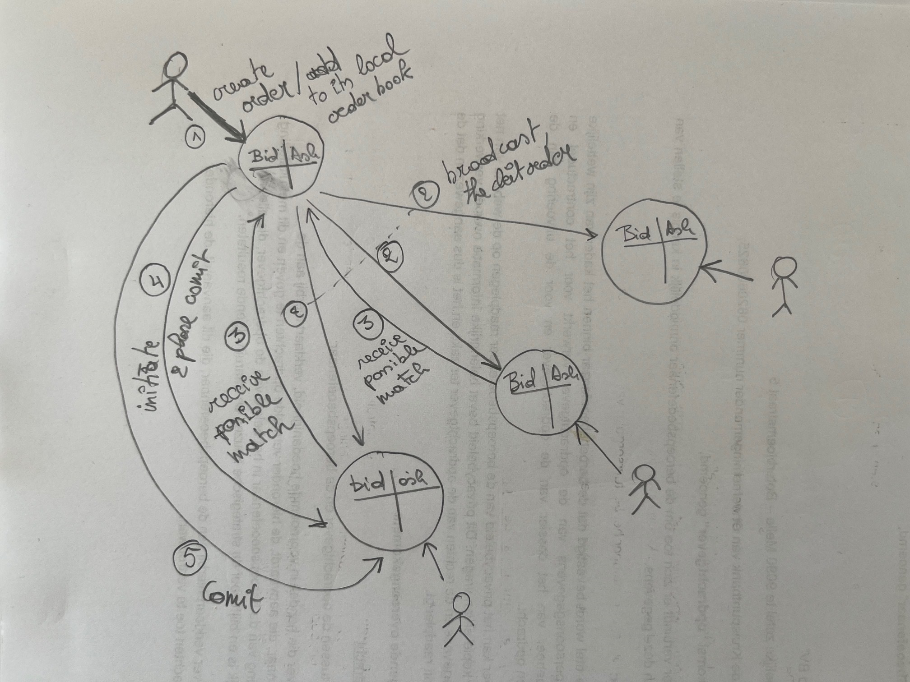

# ASSUMPTIONS

- Only limit exchange orders for a single trading pair
- Matching: bid orders are filled with the lowest ask price:
    - So, if a bid of 25 could be matched with an ask of 18 and 19, it will be matched with 18 first
      and then only further matched with 19 if there is still an amount to be filled because the bid was
      only partially filled
    - Partial matches are handled by creating new orders with the remaining amount for the client

# Simplified Implemented approach

Each node keeps the created orders by its client.
After a new order is created, the node broadcasts the order to all other nodes,
where the other nodes reply with a possible match.
The original node then picks the best match and initiates a two phase commit with the node holding the matched order.
If no match was found or the commit was not successful, or the order was not completely filled,
the node will rebroadcast the original order or new order with the unfilled amount to all other nodes.

Moving the filled order to a trading book is not implemented due to lack of time.
Locking of an order in order to prevent possible double matching is not finished due to lack of time.
Correct error handling, testing, logging and unit testing is also not implemented due to lack of time.




# Alternative Elected leader approach
An alternative approach is to have elected leader.
Only to elected leader can create a match...

## Collect - Match - Delete - Commit

All nodes keep a list of ASKs and BIDs that they received from clients (e.g. web browser).
The elected leader asks all other nodes for their best ASK and BID (in parallel),
so it gets a list of all best ASKs and BIDs:
```
[
  {node: 'node1', bestAsk: { id , amount, price }, bestBid: { id , amount, price }},
  {node: 'node2', bestAsk: { id , amount, price }, bestBid: { id , amount, price }},
  {node: 'node3', bestAsk: { id , amount, price }, bestBid: { id , amount, price }}
]
```
Note: one of the nodes 1 to 3 is the elected leader himself

From this it selects the best match (highest bid with the lowest ask) and creates a match.
It asks the nodes that had the respective ask and bid to delete the bid and ask ...
If the delete ops are successful, it commits the match to a DB
and starts the next round of collect - match - delete - commit.

# Electing a leader
To elect a leader
A poor man's election algorithm could be:
- every node has a variable called leader
- every node clears its leader variable every 10 seconds, except if it received a message from the leader in the last 10 seconds
- every node sends a 'become leader' message to the other nodes if its leader variable is empty, between every 1 minute and 5 minutes
    - if a node gets a 'become leader' message and its leader variable is set and different from the sender of the message, it throws an error
      => When the leader dies, the other nodes will at random times try to become leader...
      if one does not get all the other nodes the attempt fails
      => This is likely ok, but best to do some research
      => I believe this with this approach, in case of a split brain, the system can remain operational
      something like this could be used: https://github.com/mkralla11/safe-redis-leader


